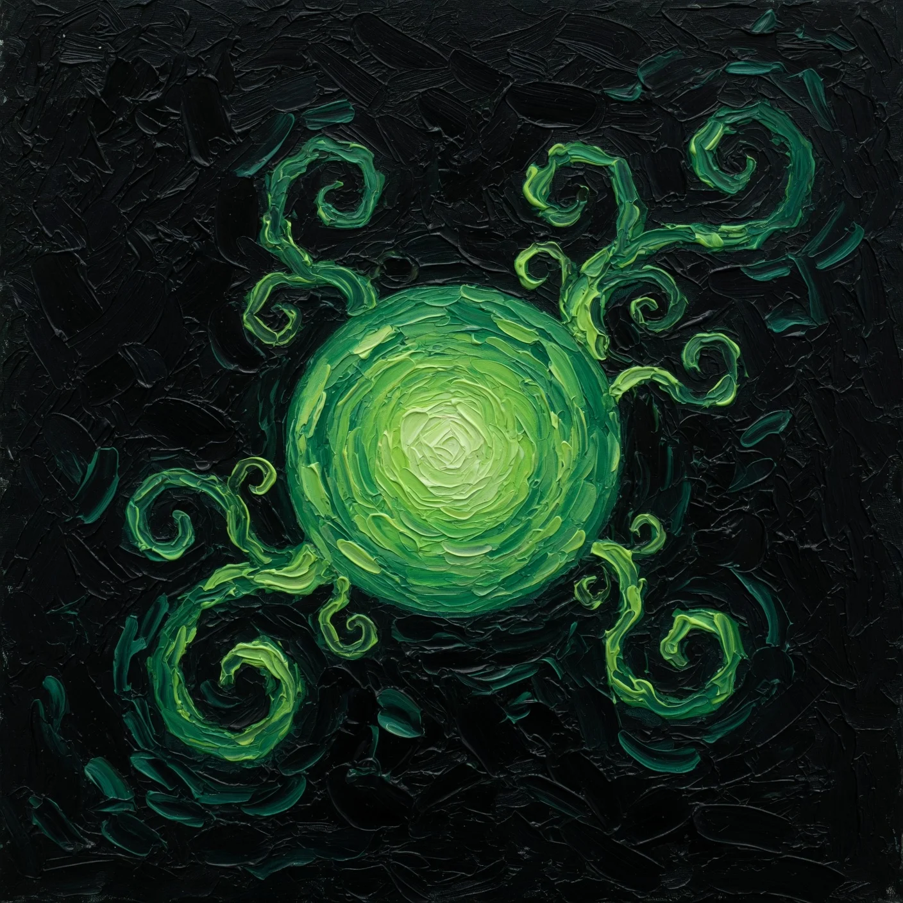

<p align="center">
  
</p>

<p align="center">
  <a href="https://mossferry.muslewski.com"></a>
  <a href="https://github.com/muslewski/mossferry"></a>
</p>

```
           |>
         __|__               __
      __|_o_o_|__           / _|___ _ _ _ _ _  _
    _|___________|_        |  _/ -_) '_| '_| || |
   \   o   o   o   /       |_| \___|_| |_|  \_, |
 ~~~\_____________/~~~~~~~~~~~~~~~~~~~~~~~~ |__/ ~~
```

# mossferry — marketing website

Public one-pager for **[mossferry](https://github.com/muslewski/mossferry)** — the green ferry between your machines.

**Live → [mossferry.muslewski.com](https://mossferry.muslewski.com)**

> **Looking for the tool?** `ferry` / `repo-session` install:  
> **https://github.com/muslewski/mossferry**

## Brand

Abyss green · spore mark · ferryman / prow / lamp path · signal stations.

| Asset | Role |
|-------|------|
| `public/mossferry4.webp` | Spore hero still |
| `public/mossferry1–3.webp` | Ferryman, hull, prow |
| `public/video/v*.mp4` | Path station reels |

## Develop

```bash
npm install && npm run dev
npm run build
```

## Deploy

Vercel · **mossferry.muslewski.com**

## License

MIT-family marketing site. Brand art © Mateusz Muslewski.
